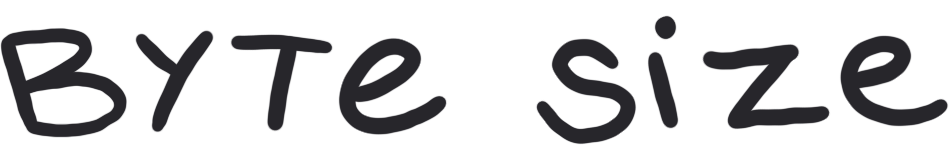

# A conversational course in computer science

Computers might be boxes of magic rocks, but they shouldn’t be mystical. We believe that everyone is capable of learning to program. Byte Size is a conversational course in computer science. We’ll chat about fun topics and teach core concepts in computing in a way that’s palatable regardless of your background. Join our conversation and you’ll be able to call yourself a computer scientist, too.

Each chapter focuses on a broad topic in computer science, from **programming basics** to **computing and humanity**—all broken up into several short, easily-digestible episodes (bytes!) We also chat with a wide variety of computer scientists to provide additional insight on the topics we discuss.
