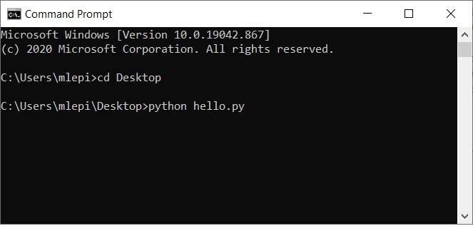
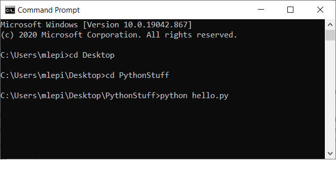

<iframe src="https://anchor.fm/bytesizecs/embed/episodes/0-2-Hello--Python--Writing-your-first-program-et4f6e" height="102px" width="400px" frameborder="0" scrolling="no"></iframe>

# 0-2: Hello, Python!

In ten minutes, you can be a programmer. This byte provides a tutorial for getting started writing code and building your first Python program.

We recommend that you start by start by listening to the episode. Some instructions for downloading and installing Python are below.

## Installing Python

(Explain why we need to install a Python interpreter on our computer in order to write code in Python)

### Downloading Python
In order to run Python programs, you to install a Python interpreter on your machine. This is a program that helps your computer understand instructions in the Python language. 

Probably the easiest way to install Python is to go to [Python.org](https://www.python.org/downloads/). 
They have a big yellow button near the top-left corner of the page that you can click to download the latest version of Python.

During the installation process, it should give you the option to **add Python to your PATH** . You want to check the box to add Python to your PATH. 
This tells your operating system (Windows or MacOS) that you want Python to be able to use Python in a terminal windows (this is also called the command line). 
You may decide that the command line is convenient, or you might decide to run your Python programs in other ways, but it is very nice to have the option. 

### Making a Python File

A Python file is just a plain text file. You can use any program that works with plain text. 

If you are Windows user, Notepad works fine for simple programs. 

The Python program you downloaded also comes with a text editor (see IDLE below). 

[Here are some instructions](2-HelloPython.md) for writing your first Python program. 

You should always save your Python programs with a **.py** at the end. (For example, hello.py) 
The **.py** at the end of the filename helps your computer to know that the text that you wrote in the file is a bunch of Python instructions. 

### Using the Terminal Window

One way to run Python programs is to use the terminal window. Using a terminal window is also sometimes called using the command line.

In Windows, you get to the terminal window by typing **cmd** into the text field in the lower-left corner next to the windows icon (**cmd** is short for command line). 

For a Mac, the terminal window commands (below) are exactly the same, but you open the terminal window by searching for **terminal** in the MacOS Finder.

When I go to the terminal window, the first thing that I need to tell the computer where (in what folder) I put my Python file. 



In this example, I saved my Python file (hello.py) on my Desktop and so I need to tell the computer to go to my Desktop. 

The **cd** command in the terminal window tells the computer to **change directories** (a directory is another name for a folder). 

After I use **cd** to go to my desktop, I then just type **python** followed by the filename to run the python program. 



You might want to create a folder on your Desktop to store your Python files. 

In this example, I made a folder called **PythonStuff** on my desktop and saved **hello.py** into that folder. 

I then use the **cd** command to go to my Desktop, and then once I am at my Desktop, I use the **cd** command again to step inside a folder on my desktop.

### Using IDLE

Another way to run Python programs is to use IDLE, a program that came in the package that you downloaded. 

You can open IDLE by typing **IDLE** either in the Windows search field (down by the windows icon) or in the MacOS Finder. 

When IDLE starts up, the first thing you want to do is select **New File** from the **File** menu. 
This brings you to the IDLE text editor (which is basically just like Windows Notepad). 

You type your Python commands into the file. Then when you are done, you can save the file (from the **File** menu). We recommend making a new folder for your Python files, perhaps on your Desktop.

You can run the Python commands in your file by selecting **Run Module** from the top of the **Run** menu. (A Python module is just another name for a Python program.)

Once you have Python on your computer, you should check out our example code below for a "Hello World" program in Python.

## Example: Hello World!

Our first Python program asks Python to print (display to the screen) the message:  Hello World!

*Writing a program that shouts "Hello World!" every time you learn a new language is a computer science tradition [dating back to the 1970s!](https://en.wikipedia.org/wiki/%22Hello,_World!%22_program)*

In Python, this only requires a single line of code:

```python
print("Hello World!")
```

You can create a new text file, type this command into the file, and then save it. We recommend that you name it `hello.py`. (You could also download this code as a <a download href="hello.py">Python program</a>, but really it is more fun to make your own Hello World program from scratch.)

Let's talk more about what `print("Hello World!")` is doing.
