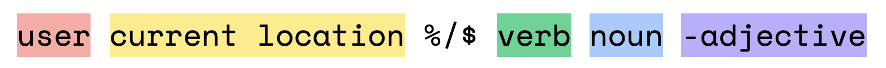

# Chapter 0 - Introduction: Student Questions!

This page has public answers to some of our most frequently asked questions for this chapter.

Question not answered here, but you'd like it to be? [Shoot us a voice message](https://anchor.fm/bytesizecs/message) and we might feature it here and in the podcast!

## Terminal/command line syntax: How to get the terminal to listen to your commands

The terminal can be confusing when you first start using it. After a while it will become second nature. 

The terminal only accepts sentences in a certain format and gets really confused if you give it something else.

### Anatomy of a terminal command



Any given line in a terminal window will look like this:

1. The username of whoever is using the terminal. (Probably your name.)
2. The current folder on your computer where the terminal window is operating out of. This is important context because when you're opening files, you'll have to give the terminal directions on where to find those files *from where you are currently.*
3. A symbol separating that contextual information from the stuff you'll type in. Sometimes this is a %, sometimes it's a $, sometimes it's a > or something else. You can't type to directly modify the symbol or anything before it, but you can change your user and location through commands.
4. The command you are executing.
5. The thing you want to execute that command on or with.
6. Optionally, you'll also see "flags" at the end of a command denoted with a `-`. These are kind of like adjectives that modify the command you're giving.

(Some terminals will have 1 and 2 in a different order, but everything you put after the symbol (3) is the same order every time no matter what.)

Importantly, all of these elements are always separated by spaces.

Some examples of this:

#### Change the folder you're in

```sh
username currentFolder % cd newFolder
```
The verb is `cd` ("change directory") and the noun (place) we want to `cd` to here is `newFolder`.

After you run this command, `newFolder` should replace `currentFolder` on the left.

You can also give it a whole path to a different folder, e.g. `cd insideFolder/path/to/anotherFolder/newFolder2`. In this case, `newFolder2` will replace `currentFolder` once the command is executed successfully.

#### Run a Python program

```sh
username currentFolder % python pythonFile.py
```
The verb is `python` and the noun (program) we want to `python` here is `pythonFile.py`. If your python program is in a different location than `currentFolder`, you'll have to tell the terminal where to find it, e.g. `python insideFolder/pythonFile.py`.

#### See who owns a particular Web address (Mac/Linux only)

```sh
username currentFolder % whois ncf.edu
```
For this command, the current location doesn't matter at all. The verb is `whois` and the noun (website) we want to `whois` here is `ncf.edu`. When you run this command, the `whois` program built into your (Mac/Linux) computer will search internet directories to find out who owns the domain name you specified.

If you want to learn more about the command-line interface and things you can do with the terminal, I found [this cool guide](https://medium.com/@JuxtaposedWords/an-introduction-to-mac-s-terminal-part-i-cli-vs-gui-b6acd3794d7c) with a lot of good information for beginner to intermediate terminal users.

#### Example with flags: Prevent your computer screen from turning off (Mac only)
<span style="color:red">**Warning: This command might be dangerous**</span>
```sh
username ~ % caffeinate -d
```
In this example, the verb is `caffeinate` and the `-d` adjective describes how to `caffeinate`. The `d` stands for display. You could replace the `-d` with another flag to make something else happen, e.g. `-i` to prevent idle sleeping. 

The flags (adjectives) available for any particular command (verb) depend on the command itself. You will probably not need to use flags for this course, but it's good to have seen them before in case you ever need to use them for something else.

### Common mistakes

#### Mistake 1: Misunderstanding the difference between nouns and verbs

I have seen some people say `cd python3 hello.py`. This confuses the terminal because it sees `cd python3`, thinks "okay, we're changing directories to `python3`, then one of two things happen:
1. There isn't a `python3` folder inside the current folder, so the terminal says "I can't move to `python3` because it doesn't exist." and dies.
2. There *is* a `python3` folder inside the current folder, so the terminal moves there. It then sees a second noun—`hello.py`—and doesn't know what to do with it because `cd` can only change directories to a single place.

Remember that the terminal can only handle *one* verb at a time and the verb you use affects what kind of noun it's expecting to see next.

#### Mistake 2: Accidentally swapping the spaces with another character

I have occasionally forgotten to put a space after a `cd` command, which confuses my terminal. For example, if I say:

```sh
eleanor@embp ~ % cd/Users/eleanor/Documents/thesis/lists 
```

the terminal thinks the verb I'm giving it is `cd/Users/eleanor/Documents/thesis/lists` and it's like, "what? I don't know how to do a `cd/Users/eleanor/Documents/thesis/lists`!" and dies. 

#### Mistake 3: Typos

The terminal gets confused if the command you're giving it is even one character off (see above.) If you're getting a strange error, it's possible that you spelled things wrong. Note that commands are also **case-sensitive.** (`PYTHON` ≠ `python`.)

## Writing code and using the terminal is intimidating! Isn't there a less scary way where I can just click buttons?

## Who made the first programming language?

## How are programming languages developed? For what purposes are they created?

## What makes Python special?
