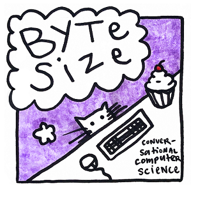

## Byte Size: Conversational Computer Science

Computers might be boxes of magic rocks, but they shouldn’t be mystical. We believe that everyone is capable of learning to program. Byte Size is a conversational course in computer science. We’ll chat about fun topics and teach core concepts in computing in a way that’s palatable regardless of your background. Join our conversation and you’ll be able to call yourself a computer scientist, too.

## Structure of the Series

Each chapter focuses on a broad topic in computer science, from **programming basics** to **computing and humanity**. Each chapter is broken up into several short, easily-digestible episodes. We also include a wide variety of computer scientists who join us to provide aditional insight on the topics we discuss.  [Get started with our first chapter: Introduction](http://learncswith.us/chapters/0-Introduction/0-contents.html)

In addition to the episodes, each chapter also contains practice materials and links to supplimental information.

This podcast is also available at:  ?? iTunes ??

## Contact Email
info@lerncswith.us
